# Expense Management System - Architecture

## Overview

This document describes the architecture of the modernized Expense Management application deployed on Azure.

## Architecture Diagram

```mermaid
graph TB
    subgraph "User Access"
        User[👤 User/Browser]
    end

    subgraph "Azure Cloud"
        subgraph "Application Layer"
            AppService[🌐 Azure App Service<br/>ASP.NET 8 Razor Pages<br/>+ REST API]
        end

        subgraph "Authentication & Identity"
            ManagedID[🔐 User-Assigned<br/>Managed Identity]
        end

        subgraph "Data Layer"
            SQL[(💾 Azure SQL Database<br/>Northwind<br/>Entra ID Auth Only)]
        end

        subgraph "Monitoring"
            AppInsights[📊 Application Insights<br/>Telemetry & Logs]
            LogAnalytics[📋 Log Analytics<br/>Workspace]
        end

        subgraph "GenAI Layer (Optional)"
            OpenAI[🤖 Azure OpenAI<br/>GPT-4o Model<br/>Sweden Central]
            AISearch[🔍 Azure AI Search<br/>RAG Support]
        end
    end

    User -->|HTTPS| AppService
    AppService -.->|Uses| ManagedID
    ManagedID -->|Authenticates| SQL
    ManagedID -->|Authenticates| OpenAI
    ManagedID -->|Authenticates| AISearch
    AppService -->|Telemetry| AppInsights
    AppInsights -->|Stores Logs| LogAnalytics
    SQL -->|Diagnostic Logs| LogAnalytics
    AppService -->|Diagnostic Logs| LogAnalytics

    style AppService fill:#0078D4,color:#fff
    style SQL fill:#0078D4,color:#fff
    style ManagedID fill:#00A4EF,color:#fff
    style AppInsights fill:#68217A,color:#fff
    style LogAnalytics fill:#68217A,color:#fff
    style OpenAI fill:#10A37F,color:#fff
    style AISearch fill:#0078D4,color:#fff
```



## Components

### Application Layer

#### Azure App Service
- **Purpose**: Hosts the ASP.NET 8 Razor Pages application
- **Tier**: Standard S1 (production-ready, no cold starts)
- **Runtime**: Linux, .NET 8
- **Features**:
  - Always On enabled for consistent performance
  - HTTPS only for security
  - TLS 1.2 minimum
  - HTTP/2 enabled

#### Application Features
- **Razor Pages UI**:
  - Dashboard (Index page)
  - Add Expense form
  - View/Search Expenses
  - Approve/Reject Expenses
  - Chat interface (with GenAI)

- **REST API**:
  - Swagger/OpenAPI documentation
  - Full CRUD operations for expenses
  - Approval workflows
  - Search and filtering

### Authentication & Identity

#### User-Assigned Managed Identity
- **Purpose**: Provides passwordless authentication for the application
- **Authenticates To**:
  - Azure SQL Database (no connection strings with passwords)
  - Azure OpenAI (no API keys)
  - Azure AI Search (no admin keys)

- **Benefits**:
  - No secrets to manage or rotate
  - Automatic credential lifecycle
  - Azure AD integration
  - Least privilege access

### Data Layer

#### Azure SQL Database
- **Database**: Northwind
- **Tier**: Basic (suitable for dev/test)
- **Schema**:
  - Users, Roles
  - ExpenseCategories
  - ExpenseStatus
  - Expenses

- **Security**:
  - **Entra ID-only authentication** (no SQL logins)
  - Managed identity for application access
  - Azure Firewall enabled for Azure services
  - Dynamic IP rules for developer access
  - Connection encryption (TLS)

- **Data Access**:
  - All queries use stored procedures
  - No dynamic SQL in application code
  - Prevents SQL injection
  - Performance optimization with cached execution plans

### Monitoring

#### Application Insights
- **Purpose**: Application performance monitoring and diagnostics
- **Collects**:
  - Request telemetry
  - Dependency calls
  - Exceptions and errors
  - Custom events
  - Performance metrics

#### Log Analytics Workspace
- **Purpose**: Centralized log aggregation and analysis
- **Diagnostic Settings**:
  - App Service: HTTP logs, console logs, application logs
  - SQL Database: Query stats, errors, timeouts, blocks, deadlocks
  - Azure OpenAI: Request/response logs (if deployed)

### GenAI Layer (Optional)

Deployed only when using the `-DeployGenAI` switch.

#### Azure OpenAI
- **Model**: GPT-4o (latest)
- **Region**: Sweden Central (better quota availability)
- **Capacity**: 8 tokens/minute
- **Tier**: S0 (pay-as-you-go)
- **Features**:
  - Function calling for database operations
  - Natural language queries
  - Expense management actions

#### Azure AI Search
- **Tier**: Basic
- **Purpose**: RAG (Retrieval-Augmented Generation) support
- **Features**:
  - Context injection for chat
  - Document search capabilities
  - Vector search (future enhancement)

## Data Flow

### User Creates Expense

```
User → App Service → Managed Identity → SQL Database
                  ↓
            Stored Procedure: CreateExpense
                  ↓
            Return new expense
```

### Manager Approves Expense

```
Manager → App Service → Managed Identity → SQL Database
                     ↓
               Stored Procedure: ApproveExpense
                     ↓
               Update status & reviewer
```

### Chat Query (with GenAI)

```
User → App Service → Managed Identity → Azure OpenAI
                  ↓
            AI processes request
                  ↓
            Function Calling
                  ↓
            App Service API
                  ↓
            Managed Identity → SQL Database
                  ↓
            Data returned to AI
                  ↓
            Formatted response to user
```

## Security Architecture

### Zero Secrets Approach

✅ **No passwords** - Managed identity for SQL  
✅ **No API keys** - Managed identity for OpenAI & Search  
✅ **No connection strings with secrets** - All use managed identity authentication  
✅ **No secrets in code** - Environment variables configured in Azure  
✅ **No secrets in CI/CD** - OIDC authentication for GitHub Actions

### Network Security

- **HTTPS Only**: All traffic encrypted in transit
- **Azure Firewall**: Database only accessible from Azure services
- **TLS 1.2+**: Minimum encryption protocol
- **Private Endpoints** (future): For additional isolation

### Identity & Access

- **Entra ID**: All authentication via Azure AD
- **RBAC**: Fine-grained role assignments
- **Managed Identity**: No credential management
- **Least Privilege**: Minimum required permissions

## Deployment Architecture

### Infrastructure as Code

- **Bicep Templates**: Declarative infrastructure definition
- **Modular Design**: Separate modules for each resource type
- **Parameter Files**: Type-safe configuration
- **Validation**: Built-in Bicep validation before deployment

### Deployment Flow

```
1. Infrastructure Deployment (deploy-infra/deploy.ps1)
   ↓
   - Deploy Bicep templates
   - Wait for SQL Server
   - Import database schema
   - Create managed identity database user
   - Import stored procedures
   - Configure App Service settings
   - Save deployment context
   ↓
2. Application Deployment (deploy-app/deploy.ps1)
   ↓
   - Read deployment context
   - Build .NET application
   - Create zip package
   - Deploy to App Service
   - Display URLs
```

### CI/CD Pipeline

```
GitHub Actions Trigger
   ↓
OIDC Authentication (no secrets)
   ↓
Infrastructure Job
   - Bicep deployment
   - Database setup
   ↓
Application Job
   - Build .NET app
   - Deploy to Azure
```

## Scaling Considerations

### Current Setup (Development/Test)

- **App Service**: S1 (1 core, 1.75 GB RAM)
- **SQL Database**: Basic (2 GB storage)
- **Suitable For**: Small teams, development, POC

### Production Recommendations

- **App Service**: Scale to P-series for production workloads
- **SQL Database**: Scale to Standard or Premium tiers
- **High Availability**: Enable zone redundancy
- **Auto-scaling**: Configure based on CPU/memory metrics
- **CDN**: Add Azure CDN for static assets
- **Application Gateway**: Add load balancing and WAF

## Cost Optimization

### Development/Test

- Basic/Standard tiers keep costs low
- Consider Dev/Test pricing for non-production
- Use B-series VMs for App Service Plan (even cheaper)

### Production

- Reserved instances for predictable workloads
- Azure Hybrid Benefit for Windows Server
- Autoscaling to match demand
- Monitor unused resources

## Monitoring & Diagnostics

### Application Insights Queries

```kusto
// Failed requests
requests
| where success == false
| summarize count() by name, resultCode

// Slow requests
requests
| where duration > 1000
| project timestamp, name, duration, resultCode

// Dependency calls
dependencies
| where type == "SQL"
| summarize avg(duration) by name
```

### SQL Diagnostics

```kusto
// Long-running queries
AzureDiagnostics
| where Category == "QueryStoreRuntimeStatistics"
| where avg_duration_s > 1
| project timestamp, statement_s, avg_duration_s
```

## Future Enhancements

- [ ] Add Azure Key Vault for additional secrets management
- [ ] Implement Private Endpoints for network isolation
- [ ] Add Azure Front Door for global distribution
- [ ] Implement caching with Azure Redis Cache
- [ ] Add blob storage for receipt attachments
- [ ] Implement Azure AD authentication for users
- [ ] Add multi-region deployment
- [ ] Implement backup and disaster recovery

## References

- [Azure App Service Best Practices](https://learn.microsoft.com/en-us/azure/app-service/app-service-best-practices)
- [Azure SQL Security](https://learn.microsoft.com/en-us/azure/azure-sql/database/security-best-practice)
- [Managed Identities](https://learn.microsoft.com/en-us/azure/active-directory/managed-identities-azure-resources/overview)
- [Azure Monitor](https://learn.microsoft.com/en-us/azure/azure-monitor/overview)
